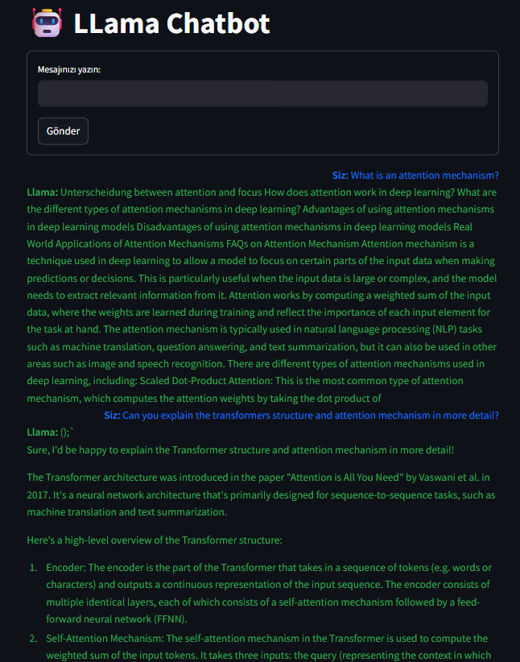

# LlamaChatbot

## Description

A local chatbot application designed for large language models. It offers a user-friendly and modern experience with a Streamlit interface.

## Features

- Provides more responsive answers to questions about large language models
- Works with the local Llama 2 model
- Modern and simple Streamlit interface
- Saves chat history
- Fast and secure local processing

## Requirements

- Python 3.8+
- Streamlit
- llama-cpp-python
- Llama 2 GGUF model file

## Notes

- The model file must be in GGUF format
- The initial model loading may take some time
- A powerful CPU is recommended for performance