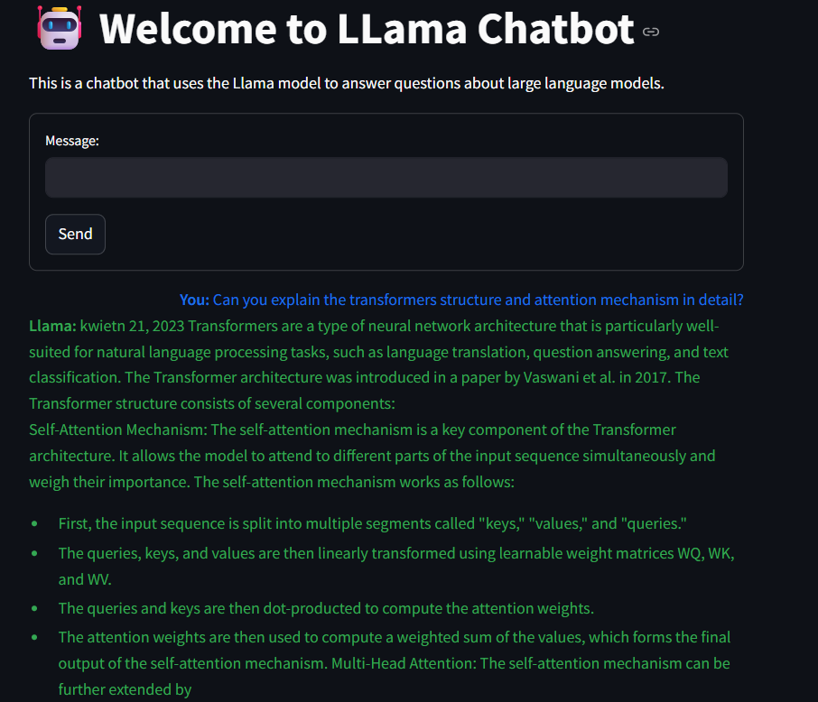

# Llama2Chatbot

## Açıklama

Büyük dil modelleri için hazırlanmış yerel bir chatbot uygulaması. Streamlit arayüzü ile kullanıcı dostu ve modern bir deneyim sunar.

## Özellikler

- Büyük dil modelleri hakkında sorulan sorulara daha duyarlı cevap verir
- Yerel Llama 2 modeli ile çalışır
- Modern ve sade Streamlit arayüzü
- Sohbet geçmişi kaydetme
- Hızlı ve güvenli yerel işlem

Tarayıcınızda açılan arayüzden chatbot ile sohbet edebilirsiniz.

## Gereksinimler

- Python 3.8+
- Streamlit
- llama-cpp-python
- Llama 2 GGUF model dosyası

## Notlar

- Model dosyasının GGUF formatında olması gerekir
- İlk çalıştırmada model yükleme işlemi biraz zaman alabilir
- Performans için güçlü bir CPU önerilir